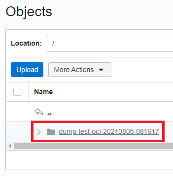

# MySQL Technology Cafe 13

「MySQL Technology Cafe #13」で利用した、デモ環境の構築方法、資材置き場です。

インストール方法は、[MySQL Operator for Kubernetes](https://github.com/mysql/mysql-operator)をベースとしてますが、一部カスタマイズしています。

環境は、OCI（Oracle Cloud Infrastructure）前提となります。

## Installation of the MySQL Operator

Namespace `mysql-operator` を作成します。

```
kubectl create ns mysql-operator
```
```
namespace/mysql-operator created
```

MySQL Operator をインストールします。

```
kubectl apply -f https://raw.githubusercontent.com/mysql/mysql-operator/trunk/deploy/deploy-crds.yaml
```
```
customresourcedefinition.apiextensions.k8s.io/innodbclusters.mysql.oracle.com created
customresourcedefinition.apiextensions.k8s.io/mysqlbackups.mysql.oracle.com created
customresourcedefinition.apiextensions.k8s.io/clusterkopfpeerings.zalando.org created
customresourcedefinition.apiextensions.k8s.io/kopfpeerings.zalando.org created
```

```
kubectl apply -f https://raw.githubusercontent.com/mysql/mysql-operator/trunk/deploy/deploy-operator.yaml
```
```
serviceaccount/mysql-sidecar-sa created
clusterrole.rbac.authorization.k8s.io/mysql-operator created
clusterrole.rbac.authorization.k8s.io/mysql-sidecar created
clusterrolebinding.rbac.authorization.k8s.io/mysql-operator-rolebinding created
clusterkopfpeering.zalando.org/mysql-operator created
Warning: kubectl apply should be used on resource created by either kubectl create --save-config or kubectl apply
namespace/mysql-operator configured
serviceaccount/mysql-operator-sa created
deployment.apps/mysql-operator created
```

Namespace `mysql-operator` に MySQL Operator がインストールされたことを確認します。

```
kubectl get deployment -n mysql-operator mysql-operator
```
```
NAME             READY   UP-TO-DATE   AVAILABLE   AGE
mysql-operator   1/1     1            1           30s
```

## Using the MySQL Operator to setup a MySQL InnoDB Cluster

InnoDBクラスタを作成する上で必要となる、MySQLのrootユーザ情報（パスワード）をSecretに登録します。

```
kubectl create secret generic  mypwds --from-literal=rootPassword="mysqlp@ssword"
```
```
secret/mypwds created
```

サンプルクラスタのマニフェストを作成します。このサンプルクラスタは、​​3つのMySQLサーバーインスタンスと1つのMySQLルーターインスタンスを持つInnoDBクラスタです。

```
vim sample-cluster.yaml
```

```
apiVersion: mysql.oracle.com/v2alpha1
kind: InnoDBCluster
metadata:
  name: mycluster
spec:
  secretName: mypwds
  instances: 3
  version: "8.0.25"
  router:
    instances: 1
    version: "8.0.25"
```

マニフェストを適用します。

```
kubectl apply -f sample-cluster.yaml
```
```
innodbcluster.mysql.oracle.com/mycluster created
```

InnoDBクラスタの状況を確認します。

```
kubectl get innodbcluster --watch
```
```
NAME          STATUS    ONLINE   INSTANCES   ROUTERS   AGE
・
・
・
mycluster   ONLINE           3        3           1         7m7s
```

## Connecting to the MYSQL InnoDB Cluster

InnoDBクラスタに接続する、KubernetesクラスタのServiceを確認します。後のWordPressと連携する際に必要となります。

```
kubectl get service mycluster
```
```
NAME        TYPE        CLUSTER-IP     EXTERNAL-IP   PORT(S)                               AGE
mycluster   ClusterIP   10.96.201.29   <none>        6446/TCP,6448/TCP,6447/TCP,6449/TCP   8m13s
```

エクスポートされたポートは、MySQLプロトコルおよびXプロトコルの読み取り/書き込み、読み取り専用ポートです。

```
kubectl describe service mycluster
```

```
Name:              mycluster
Namespace:         default
Labels:            mysql.oracle.com/cluster=mycluster
                   tier=mysql
Annotations:       <none>
Selector:          component=mysqlrouter,mysql.oracle.com/cluster=mycluster,tier=mysql
Type:              ClusterIP
IP Families:       <none>
IP:                10.43.203.248
IPs:               <none>
Port:              mysql  6446/TCP
TargetPort:        6446/TCP
Endpoints:         <none>
Port:              mysqlx  6448/TCP
TargetPort:        6448/TCP
Endpoints:         <none>
Port:              mysql-ro  6447/TCP
TargetPort:        6447/TCP
Endpoints:         <none>
Port:              mysqlx-ro  6449/TCP
TargetPort:        6449/TCP
Endpoints:         <none>
Session Affinity:  None
Events:            <none>
```

## Installation of WordPress

### NFS Server

NFSサーバを構築します。最初にPersistentVolumeClaimを作成します。

```
vim nfs-pvc.yaml
```
```
apiVersion: v1
kind: PersistentVolumeClaim
metadata:
  name: nfs-pvc
spec:
  storageClassName: "oci-bv"
  accessModes:
    - ReadWriteOnce
  resources:
    requests:
      storage: 50Gi
```

マニフェストを適用します。

```
kubectl apply -f nfs-pvc.yaml
```
```
persistentvolumeclaim/nfs-pvc created
```

NFSサーバを作成します。

```
vim nfs-server.yaml
```

```
apiVersion: apps/v1
kind: Deployment
metadata:
  name: nfs-server
spec:
  replicas: 1
  selector:
    matchLabels:
      role: nfs-server
  template:
    metadata:
      labels:
        role: nfs-server
    spec:
      containers:
      - name: nfs-server
        image: gcr.io/google_containers/volume-nfs:0.8
        ports:
          - name: nfs
            containerPort: 2049
          - name: mountd
            containerPort: 20048
          - name: rpcbind
            containerPort: 111
        securityContext:
          privileged: true
        volumeMounts:
          - mountPath: /exports
            name: nfs-local-storage
      volumes:
        - name: nfs-local-storage
          persistentVolumeClaim:
            claimName: nfs-pvc
```

マニフェストを適用します。

```
kubectl apply -f nfs-server.yaml
```
```
deployment.apps/nfs-server created
```

WordPressのPersistentVolumeから指定するNFSのServiceを作成します。

```
vim nfs-service.yaml
```

```
apiVersion: v1
kind: Service
metadata:
  name: nfs-service
spec:
  ports:
    - name: nfs
      port: 2049
    - name: mountd
      port: 20048
    - name: rpcbind
      port: 111
  selector:
    role: nfs-server
```

マニフェストを適用します。

```
kubectl apply -f nfs-service.yaml
```
```
service/nfs-service created
```

WordPressのPersistentVolumeから指定するNFSのServiceのClusterIPを確認します。

```
kubectl get services
```
```
NAME                  TYPE        CLUSTER-IP      EXTERNAL-IP   PORT(S)                               AGE
kubernetes            ClusterIP   10.96.0.1       <none>        443/TCP                               16m
mycluster             ClusterIP   10.96.198.46    <none>        6446/TCP,6448/TCP,6447/TCP,6449/TCP   9m33s
mycluster-instances   ClusterIP   None            <none>        3306/TCP,33060/TCP,33061/TCP          9m33s
nfs-service           ClusterIP   10.96.189.130   <none>        2049/TCP,20048/TCP,111/TCP            14s
```

### WordPress

WordPressのPersistentVolumeを作成します。

```
vim wordpress-pv.yaml
```
```
apiVersion: v1
kind: PersistentVolume
metadata:
  name: wordpress-pv
  labels:
    type: local
spec:
  persistentVolumeReclaimPolicy: Delete
  storageClassName: wordpress
  capacity:
    storage: 10Gi
  accessModes:
    - ReadWriteMany
  nfs:
    server: xx.xx.xx.xx #「nfs-service」のCLUSTER-IPを定義
    path: /
```

マニフェストを適用します。

```
kubectl apply -f wordpress-pv.yaml
```
```
persistentvolume/wordpress-pv created
```

WordPressのPersistentVolumeClaimを作成します。

```
vim wordpress-pvc.yaml
```
```
apiVersion: v1
kind: PersistentVolumeClaim
metadata:
  name: wordpress-pvc
  labels:
    app: wordpress
    tier: wordpress
spec:
  storageClassName: wordpress
  accessModes:
    - ReadWriteMany
  resources:
    requests:
      storage: 5Gi
```

マニフェストを適用します。

```
kubectl apply -f wordpress-pvc.yaml
```
```
persistentvolumeclaim/wordpress-pvc created
```

WordPressのPersistentVolumeとPersistentVolumeClaimが連携していることを確認します。

```
kubectl get persistentvolumes,persistentvolumeclaims
```
```
NAME                                                                                                        CAPACITY   ACCESS MODES   RECLAIM POLICY   STATUS   CLAIM                         STORAGECLASS   REASON   AGE
persistentvolume/csi-343c6a85-ceac-41ad-9ec3-5a9c66c16be2                                                   50Gi       RWO            Delete           Bound    default/nfs-pvc               oci-bv                  116s
persistentvolume/ocid1.volume.oc1.ap-osaka-1.abvwsljr4ub2x5hdai6hrobi2c742b7cogbzttaln2cv7tvvn6efcd4zukga   50Gi       RWO            Delete           Bound    default/datadir-mycluster-2   oci                     6m
persistentvolume/ocid1.volume.oc1.ap-osaka-1.abvwsljr7zgyejcsd3gg5vbzlzgpr72nkxn2x4qtwax5lj4tskpsnnstnm2q   50Gi       RWO            Delete           Bound    default/datadir-mycluster-0   oci                     10m
persistentvolume/ocid1.volume.oc1.ap-osaka-1.abvwsljreozgjd5kz4zei24w47nee4raeef33e7o56auoqilcificgvugtqq   50Gi       RWO            Delete           Bound    default/datadir-mycluster-1   oci                     8m19s
persistentvolume/wordpress-pv                                                                               50Gi       RWX            Delete           Bound    default/wordpress-pvc         wordpress               26s

NAME                                        STATUS   VOLUME                                                                                     CAPACITY   ACCESS MODES   STORAGECLASS   AGE
persistentvolumeclaim/datadir-mycluster-0   Bound    ocid1.volume.oc1.ap-osaka-1.abvwsljr7zgyejcsd3gg5vbzlzgpr72nkxn2x4qtwax5lj4tskpsnnstnm2q   50Gi       RWO            oci            10m
persistentvolumeclaim/datadir-mycluster-1   Bound    ocid1.volume.oc1.ap-osaka-1.abvwsljreozgjd5kz4zei24w47nee4raeef33e7o56auoqilcificgvugtqq   50Gi       RWO            oci            8m30s
persistentvolumeclaim/datadir-mycluster-2   Bound    ocid1.volume.oc1.ap-osaka-1.abvwsljr4ub2x5hdai6hrobi2c742b7cogbzttaln2cv7tvvn6efcd4zukga   50Gi       RWO            oci            6m11s
persistentvolumeclaim/nfs-pvc               Bound    csi-343c6a85-ceac-41ad-9ec3-5a9c66c16be2                                                   50Gi       RWO            oci-bv         2m30s
persistentvolumeclaim/wordpress-pvc         Bound    wordpress-pv                                                                               50Gi       RWX            wordpress      12s
```

WordPressのマニフェストを作成します。

```
vim wordpress.yaml
```
```
apiVersion: apps/v1
kind: Deployment
metadata:
  name: wordpress
  labels:
    app: wordpress
spec:
  replicas: 1
  selector:
    matchLabels:
      app: wordpress
  template:
    metadata:
      labels:
        app: wordpress
    spec:
      containers:
        - image: wordpress:5.6.2
          name: wordpress
          env:
          #Service名「mycluster:6446」を定義
          - name: WORDPRESS_DB_HOST
            value: mycluster:6446
          #MySQLのデータベースパスワードを参照する定義
          - name: WORDPRESS_DB_PASSWORD
            valueFrom:
              secretKeyRef:
                name: mypwds
                key: rootPassword
          ports:
            - containerPort: 80
              name: wordpress
          #Podのマウントパス定義
          volumeMounts:
            - name: wordpress-local-storage
              mountPath: /var/www/html
      #「wordpress-pvc」を指定する定義
      volumes:
        - name: wordpress-local-storage
          persistentVolumeClaim:
            claimName: wordpress-pvc
```

マニフェストを適用します。

```
kubectl apply -f wordpress.yaml
```
```
deployment.apps/wordpress created
```

WordPressのPodがRunnninngであることを確認します。

```
kubectl get pods
```
```
NAME                          READY   STATUS    RESTARTS   AGE
mycluster-0                   2/2     Running   0          13m
mycluster-1                   2/2     Running   0          11m
mycluster-2                   2/2     Running   0          8m45s
mycluster-router-gwvpr        1/1     Running   0          11m
nfs-server-788c45b6f5-chp4k   1/1     Running   0          4m47s
wordpress-598746d47b-wfffq    1/1     Running   0          31s
```

WordPress Serviceのマニフェストを作成します。

```
vim wordpress-service.yaml
```
```
apiVersion: v1
kind: Service
metadata:
  name: wordpress-service
  labels:
    app: wordpress
spec:
  type: LoadBalancer
  ports:
    - protocol: TCP
      port: 80
      targetPort: 80
  selector:
    app: wordpress
```

マニフェストを適用します。

```
kubectl apply -f wordpress-service.yaml
```
```
service/wordpress-service created
```

EXTERNAL-IPが表示されます。実際にブラウザでアクセスすると、WordPressのセットアップ画面が表示されます。

```
kubectl get services
```
```
NAME                  TYPE           CLUSTER-IP      EXTERNAL-IP   PORT(S)                               AGE
kubernetes            ClusterIP      10.96.0.1       <none>        443/TCP                               21m
mycluster             ClusterIP      10.96.198.46    <none>        6446/TCP,6448/TCP,6447/TCP,6449/TCP   14m
mycluster-instances   ClusterIP      None            <none>        3306/TCP,33060/TCP,33061/TCP          14m
nfs-service           ClusterIP      10.96.189.130   <none>        2049/TCP,20048/TCP,111/TCP            5m11s
wordpress-service     LoadBalancer   10.96.93.51     140.xx.xx.xx  80:32606/TCP                          31s
```

## Connect to MySQL

### 1.MySQL Operator Pod に接続してMySQL Shellを実行する場合

MySQL Operator Pod からMySQL Shellを利用して mycluster-0 に接続します。

パスワードが要求されるので、MySQLのSecretに設定したパスワード（ mysqlp@ssword ）を入力します。

接続後、抜ける場合は、「\q」を実行します。

```
kubectl exec -it -n mysql-operator mysql-operator-xxxxxxxxxx-xxxxx -- mysqlsh root@mycluster-0.mycluster-instances.default.svc.cluster.local
```
```
Cannot set LC_ALL to locale en_US.UTF-8: No such file or directory
Please provide the password for 'root@mycluster-0.mycluster-instances.default.svc.cluster.local': *************
MySQL Shell 8.0.25-operator

Copyright (c) 2016, 2021, Oracle and/or its affiliates.
Oracle is a registered trademark of Oracle Corporation and/or its affiliates.
Other names may be trademarks of their respective owners.

Type '\help' or '\?' for help; '\quit' to exit.
Creating a session to 'root@mycluster-0.mycluster-instances.default.svc.cluster.local'
Fetching schema names for autocompletion... Press ^C to stop.
Your MySQL connection id is 2115 (X protocol)
Server version: 8.0.25 MySQL Community Server - GPL
No default schema selected; type \use <schema> to set one.
 MySQL  mycluster-0.mycluster-instances.default.svc.cluster.local:33060+ ssl  JS > \q
Bye!
```

### 2. mycluster-0 に接続する場合

パスワードが要求されるので、MySQLのSecretに設定したパスワード（ mysqlp@ssword ）を入力します。

接続後、抜ける場合は、「\q」を実行します。

```
kubectl exec -it mycluster-0 -- mysqlsh --mysql localroot@localhost
```
```
Defaulting container name to sidecar.
Use 'kubectl describe pod/mycluster-0 -n default' to see all of the containers in this pod.
Cannot set LC_ALL to locale en_US.UTF-8: No such file or directory
Please provide the password for 'localroot@localhost': *************
MySQL Shell 8.0.25-operator

Copyright (c) 2016, 2021, Oracle and/or its affiliates.
Oracle is a registered trademark of Oracle Corporation and/or its affiliates.
Other names may be trademarks of their respective owners.

Type '\help' or '\?' for help; '\quit' to exit.
Creating a Classic session to 'localroot@localhost'
Fetching schema names for autocompletion... Press ^C to stop.
Your MySQL connection id is 2262
Server version: 8.0.25 MySQL Community Server - GPL
No default schema selected; type \use <schema> to set one.
 MySQL  localhost  JS > \q
Bye!
```

## MySQL Scale Out/In & Rolling Update

### Scale Out

sample-cluster.yaml のinstancesを以下に変更

instances: 3 ⇒ 5
instances: 1 ⇒ 2

```
vim sample-cluster.yaml
```
```
apiVersion: mysql.oracle.com/v2alpha1
kind: InnoDBCluster
metadata:
  name: mycluster
spec:
  secretName: mypwds
  instances: 5
  version: "8.0.25"
  router:
    instances: 2
    version: "8.0.25"
```

```
kubectl apply -f sample-cluster.yaml
```
```
innodbcluster.mysql.oracle.com/mycluster configured
```

InnoDBクラスタの状況を確認します。

```
kubectl get innodbcluster --watch
```
```
NAME        STATUS   ONLINE   INSTANCES   ROUTERS   AGE
・
・
・
mycluster   ONLINE           5        5           2         55m
```

Podも確認するとmyclusterが5、mycluster-routerが2となっていることを確認できます。

```
kubectl get pods
```
```
NAME                          READY   STATUS    RESTARTS   AGE
mycluster-0                   2/2     Running   0          25m
mycluster-1                   2/2     Running   0          22m
mycluster-2                   2/2     Running   0          20m
mycluster-3                   2/2     Running   0          4m51s
mycluster-4                   2/2     Running   0          2m41s
mycluster-router-6j2t2        1/1     Running   0          4m51s
mycluster-router-gwvpr        1/1     Running   0          22m
nfs-server-788c45b6f5-chp4k   1/1     Running   0          16m
wordpress-598746d47b-wfffq    1/1     Running   0          12m
```

OCIコンソールで、Block Volumeが追加されていることも確認できます。

WordPressで使用しているNFSのものを含めて、6 Block Volumeとなります。


### Scale In

sample-cluster.yaml のinstancesを以下に変更

instances: 3
instances: 1

```
vim sample-cluster.yaml
```
```
apiVersion: mysql.oracle.com/v2alpha1
kind: InnoDBCluster
metadata:
  name: mycluster
spec:
  secretName: mypwds
  instances: 3
  version: "8.0.25"
  router:
    instances: 1
    version: "8.0.25"
```

```
kubectl apply -f sample-cluster.yaml
```
```
innodbcluster.mysql.oracle.com/mycluster configured
```

```
kubectl get innodbcluster --watch
```
```
NAME        STATUS   ONLINE   INSTANCES   ROUTERS   AGE
・
・
・
mycluster   ONLINE   3        3           1         60m
```

```
kubectl get pods
```
```
NAME                          READY   STATUS    RESTARTS   AGE
mycluster-0                   2/2     Running   0          28m
mycluster-1                   2/2     Running   0          25m
mycluster-2                   2/2     Running   0          23m
mycluster-router-gwvpr        1/1     Running   0          25m
nfs-server-788c45b6f5-chp4k   1/1     Running   0          19m
wordpress-598746d47b-wfffq    1/1     Running   0          14m
```

現時点(2021年8月)では、myclusterとmycluster-routerのPodは、指定した数に自動で戻りますが、PVC、PV、Block Volumeは自動で削除されないので、
手動でPVCを削除します。（同時にPV、Block Volumeも削除されます。）

```
kubectl delete pvc datadir-mycluster-4
```
```
persistentvolumeclaim "datadir-mycluster-4" deleted
```

```
kubectl delete pvc datadir-mycluster-3
```
```
persistentvolumeclaim "datadir-mycluster-3" deleted
```

## Rolling Update

MySQL Shellを利用して、mysql-operatorからInnoDB Clusterのステータスを見て、イメージのバージョンが8.0.25であること確認します。

MySQL Operator Pod からMySQL Shellを利用して mycluster-0 に接続します。

パスワードが要求されるので、MySQLのSecretに設定したパスワード（ mysqlp@ssword ）を入力します。

接続後、抜ける場合は、「\q」を実行します。

```
kubectl exec -it -n mysql-operator mysql-operator-xxxxxxxxxx-xxxxx -- mysqlsh root@mycluster-0.mycluster-instances.default.svc.cluster.local
```
```
Cannot set LC_ALL to locale en_US.UTF-8: No such file or directory
Please provide the password for 'root@mycluster-0.mycluster-instances.default.svc.cluster.local': *************
MySQL Shell 8.0.25-operator

Copyright (c) 2016, 2021, Oracle and/or its affiliates.
Oracle is a registered trademark of Oracle Corporation and/or its affiliates.
Other names may be trademarks of their respective owners.

Type '\help' or '\?' for help; '\quit' to exit.
Creating a session to 'root@mycluster-0.mycluster-instances.default.svc.cluster.local'
Fetching schema names for autocompletion... Press ^C to stop.
Your MySQL connection id is 4525 (X protocol)
Server version: 8.0.25 MySQL Community Server - GPL
No default schema selected; type \use <schema> to set one.
 MySQL  mycluster-0.mycluster-instances.default.svc.cluster.local:33060+ ssl  JS > \status
MySQL Shell version 8.0.25-operator

Connection Id:                4525
Default schema:               
Current schema:               
Current user:                 root@10.244.0.2
SSL:                          Cipher in use: TLS_AES_256_GCM_SHA384 TLSv1.3
Using delimiter:              ;
Server version:               8.0.25 MySQL Community Server - GPL
Protocol version:             X protocol
Client library:               8.0.25
Connection:                   mycluster-0.mycluster-instances.default.svc.cluster.local via TCP/IP
TCP port:                     33060
Server characterset:          utf8mb4
Schema characterset:          utf8mb4
Client characterset:          utf8mb4
Conn. characterset:           utf8mb4
Result characterset:          utf8mb4
Compression:                  Enabled (DEFLATE_STREAM)
Uptime:                       28 min 1.0000 sec


 MySQL  mycluster-0.mycluster-instances.default.svc.cluster.local:33060+ ssl  JS > \q
Bye!
```

sample-cluster.yaml の2箇所のversionを以下に変更

version: "8.0.25" ⇒ "8.0.26"

```
vim sample-cluster.yaml
```
```
apiVersion: mysql.oracle.com/v2alpha1
kind: InnoDBCluster
metadata:
  name: mycluster
spec:
  secretName: mypwds
  instances: 3
  version: "8.0.26"
  router:
    instances: 1
    version: "8.0.26"
```

```
kubectl apply -f sample-cluster.yaml
```

Rolling Updateの状況を監視してみます。
mycluster-2,1,0の順番にアップデートされます。

実際に実行してみたところ、2021年8月時点では、mycluster-2のローリングアップデートは成功、
mycluter-1移行のローリングアップデートは失敗となります。

## WordPress Scale

WordPressのPod数を10に変更してスケールします。

```
kubectl scale deployment wordpress --replicas 10
```
```
deployment.apps/wordpress scaled
```

```
kubectl get pods
```
```
NAME                          READY   STATUS    RESTARTS   AGE
mycluster-0                   2/2     Running   0          31m
mycluster-1                   2/2     Running   0          28m
mycluster-2                   2/2     Running   0          26m
mycluster-router-gwvpr        1/1     Running   0          28m
nfs-server-788c45b6f5-chp4k   1/1     Running   0          22m
wordpress-598746d47b-2r776    1/1     Running   0          37s
wordpress-598746d47b-4rx94    1/1     Running   0          37s
wordpress-598746d47b-626x7    1/1     Running   0          37s
wordpress-598746d47b-bv2c2    1/1     Running   0          37s
wordpress-598746d47b-jd9sh    1/1     Running   0          37s
wordpress-598746d47b-l7t4d    1/1     Running   0          37s
wordpress-598746d47b-lhsws    1/1     Running   0          37s
wordpress-598746d47b-qht84    1/1     Running   0          37s
wordpress-598746d47b-vdf8s    1/1     Running   0          37s
wordpress-598746d47b-wfffq    1/1     Running   0          18m
```

実際にWordPressにアクセスして、初期セットアップして問題ないことを確認します。

## Self-healing(Failover) / Backup

```
kubectl create ns mysql-cluster
```
```
namespace/mysql-cluster created
```

```
kubectl config set-context --current --namespace=mysql-cluster
```
```
Context "context-cbsxdpxsfma" modified.
```

```
vim secret.yaml
```
```
apiVersion: v1
kind: Secret
metadata:
  name: mypwds
  namespace: mysql-cluster
stringData:
  rootUser: root
  rootHost: '%'
  rootPassword: root
```

```
kubectl apply -f secret.yaml
```
```
secret/mypwds created
```

```
vim oci-sample-secret.sh
```
```
kubectl create secret generic oci-credentials -n mysql-cluster \
        --from-literal=user=<user> \
        --from-literal=fingerprint=<your-fingerprint> \
        --from-literal=tenancy=<your-tenancy> \
        --from-literal=region=<your-resion> \
        --from-literal=passphrase=<your-passphrase> \
        --from-file=privatekey=<your-path>/oci_api_key.pem
```
```
chmod +x oci-sample-secret.sh
```
```
sh oci-sample-secret.sh
```
```
secret/oci-credentials created
```

```
kubectl get secrets
```
```
NAME                  TYPE                                  DATA   AGE
default-token-dkmk4   kubernetes.io/service-account-token   3      79s
mypwds                Opaque                                3      28s
oci-credentials       Opaque                                6      12s
```

```
vim mysql-cluster.yaml
```
```
apiVersion: mysql.oracle.com/v2alpha1
kind: InnoDBCluster
metadata:
  name: mysql
  namespace: mysql-cluster
spec:
  secretName: mypwds
  instances: 3
  router:
    instances: 1
  backupProfiles:
  - name: dump-instance-profile-pvc
    dumpInstance:
      storage:
        persistentVolumeClaim:
          claimName: backup-volume-claim-1
  - name: dump-instance-profile-oci
    dumpInstance:
      storage:
        ociObjectStorage:
          prefix : /
          bucketName: idbcluster_backup
          credentials: oci-credentials 
```

```
kubectl apply -f mysql-cluster.yaml
```
```
innodbcluster.mysql.oracle.com/mysql created
```

```
kubectl get innodbcluster mysql --watch
```
```
NAME    STATUS    ONLINE   INSTANCES   ROUTERS   AGE
・
・
・
mysql   ONLINE           3        3           1         6m25s
```

```
kubectl get pods
```
```
NAME                 READY   STATUS    RESTARTS   AGE
mysql-0              2/2     Running   0          24m
mysql-1              2/2     Running   0          22m
mysql-2              2/2     Running   0          20m
mysql-router-xxxxx   1/1     Running   0          22m
```

```
kubectl get services
```
```
NAME              TYPE        CLUSTER-IP      EXTERNAL-IP   PORT(S)                               AGE
mysql             ClusterIP   10.96.101.101   <none>        6446/TCP,6448/TCP,6447/TCP,6449/TCP   25m
mysql-instances   ClusterIP   None            <none>        3306/TCP,33060/TCP,33061/TCP          25m
```

```
kubectl get persistentvolumes,persistentvolumeclaims
```
```
NAME                                                                                                        CAPACITY   ACCESS MODES   RECLAIM POLICY   STATUS   CLAIM                           STORAGECLASS   REASON   AGE
persistentvolume/csi-343c6a85-ceac-41ad-9ec3-5a9c66c16be2                                                   50Gi       RWO            Delete           Bound    default/nfs-pvc                 oci-bv                  54m
persistentvolume/ocid1.volume.oc1.ap-osaka-1.abvwsljr4ub2x5hdai6hrobi2c742b7cogbzttaln2cv7tvvn6efcd4zukga   50Gi       RWO            Delete           Bound    default/datadir-mycluster-2     oci                     58m
persistentvolume/ocid1.volume.oc1.ap-osaka-1.abvwsljr7zgyejcsd3gg5vbzlzgpr72nkxn2x4qtwax5lj4tskpsnnstnm2q   50Gi       RWO            Delete           Bound    default/datadir-mycluster-0     oci                     63m
persistentvolume/ocid1.volume.oc1.ap-osaka-1.abvwsljrel777yub2l3x6qvzbjpwg3l43qf7jrxlwwvpfwvnpyd4pa5fxu4q   50Gi       RWO            Delete           Bound    mysql-cluster/datadir-mysql-1   oci                     25m
persistentvolume/ocid1.volume.oc1.ap-osaka-1.abvwsljreozgjd5kz4zei24w47nee4raeef33e7o56auoqilcificgvugtqq   50Gi       RWO            Delete           Bound    default/datadir-mycluster-1     oci                     60m
persistentvolume/ocid1.volume.oc1.ap-osaka-1.abvwsljrgweatm5e7vx65yyn5g5r62ljoubdupbzfqaecdvcfvh3kptwqlaa   50Gi       RWO            Delete           Bound    mysql-cluster/datadir-mysql-0   oci                     27m
persistentvolume/ocid1.volume.oc1.ap-osaka-1.abvwsljrkqxhpalptoxbm7tqitfkxsponosncj2b7q72vfm4mnoohvuwnj2a   50Gi       RWO            Delete           Bound    mysql-cluster/datadir-mysql-2   oci                     22m
persistentvolume/wordpress-pv                                                                               50Gi       RWX            Delete           Bound    default/wordpress-pvc           wordpress               52m

NAME                                    STATUS   VOLUME                                                                                     CAPACITY   ACCESS MODES   STORAGECLASS   AGE
persistentvolumeclaim/datadir-mysql-0   Bound    ocid1.volume.oc1.ap-osaka-1.abvwsljrgweatm5e7vx65yyn5g5r62ljoubdupbzfqaecdvcfvh3kptwqlaa   50Gi       RWO            oci            27m
persistentvolumeclaim/datadir-mysql-1   Bound    ocid1.volume.oc1.ap-osaka-1.abvwsljrel777yub2l3x6qvzbjpwg3l43qf7jrxlwwvpfwvnpyd4pa5fxu4q   50Gi       RWO            oci            25m
persistentvolumeclaim/datadir-mysql-2   Bound    ocid1.volume.oc1.ap-osaka-1.abvwsljrkqxhpalptoxbm7tqitfkxsponosncj2b7q72vfm4mnoohvuwnj2a   50Gi       RWO            oci            23m
```

InnoDB Clusterのステータスを確認します。

mysql-0 直接
```
kubectl exec -it mysql-0 -- mysqlsh root:root@localhost:3306 -- cluster status
```
```
Defaulting container name to sidecar.
Use 'kubectl describe pod/mysql-0 -n mysql-cluster' to see all of the containers in this pod.
Cannot set LC_ALL to locale en_US.UTF-8: No such file or directory
WARNING: Using a password on the command line interface can be insecure.
{
    "clusterName": "mysql", 
    "defaultReplicaSet": {
        "name": "default", 
        "primary": "mysql-0.mysql-instances.mysql-cluster.svc.cluster.local:3306", 
        "ssl": "REQUIRED", 
        "status": "OK", 
        "statusText": "Cluster is ONLINE and can tolerate up to ONE failure.", 
        "topology": {
            "mysql-0.mysql-instances.mysql-cluster.svc.cluster.local:3306": {
                "address": "mysql-0.mysql-instances.mysql-cluster.svc.cluster.local:3306", 
                "memberRole": "PRIMARY", 
                "mode": "R/W", 
                "readReplicas": {}, 
                "replicationLag": null, 
                "role": "HA", 
                "status": "ONLINE", 
                "version": "8.0.25"
            }, 
            "mysql-1.mysql-instances.mysql-cluster.svc.cluster.local:3306": {
                "address": "mysql-1.mysql-instances.mysql-cluster.svc.cluster.local:3306", 
                "memberRole": "SECONDARY", 
                "mode": "R/O", 
                "readReplicas": {}, 
                "replicationLag": null, 
                "role": "HA", 
                "status": "ONLINE", 
                "version": "8.0.25"
            }, 
            "mysql-2.mysql-instances.mysql-cluster.svc.cluster.local:3306": {
                "address": "mysql-2.mysql-instances.mysql-cluster.svc.cluster.local:3306", 
                "memberRole": "SECONDARY", 
                "mode": "R/O", 
                "readReplicas": {}, 
                "replicationLag": null, 
                "role": "HA", 
                "status": "ONLINE", 
                "version": "8.0.25"
            }
        }, 
        "topologyMode": "Single-Primary"
    }, 
    "groupInformationSourceMember": "mysql-0.mysql-instances.mysql-cluster.svc.cluster.local:3306"
}
```

mysql-0のプライマリーでデータベース、テーブルを作成して、データをインサートします。

mysql-0
```
kubectl exec -it -n mysql-cluster mysql-router-xxxxx -- mysql -uroot -h127.0.0.1 -proot -P6446
```
```
mysql: [Warning] Using a password on the command line interface can be insecure.
Welcome to the MySQL monitor.  Commands end with ; or \g.
Your MySQL connection id is 1150
Server version: 8.0.25 MySQL Community Server - GPL

Copyright (c) 2000, 2021, Oracle and/or its affiliates.

Oracle is a registered trademark of Oracle Corporation and/or its
affiliates. Other names may be trademarks of their respective
owners.

Type 'help;' or '\h' for help. Type '\c' to clear the current input statement.

mysql> select @@hostname;
+------------+
| @@hostname |
+------------+
| mysql-0    |
+------------+
1 row in set (0.00 sec)

mysql> show databases;
+-------------------------------+
| Database                      |
+-------------------------------+
| information_schema            |
| mysql                         |
| mysql_innodb_cluster_metadata |
| performance_schema            |
| sys                           |
+-------------------------------+
5 rows in set (0.00 sec)

mysql> create database test;
Query OK, 1 row affected (0.00 sec)

mysql> create table test.test (i int primary key);
Query OK, 0 rows affected (0.02 sec)

mysql> insert into test.test values (1), (2), (3);
Query OK, 3 rows affected (0.01 sec)
Records: 3  Duplicates: 0  Warnings: 0

mysql> select * from test.test;
+---+
| i |
+---+
| 1 |
| 2 |
| 3 |
+---+
3 rows in set (0.00 sec)

mysql> exit
Bye
```

mysql-1に接続して、グループレプリケーションできていることを確認します。

mysql-1
```
kubectl exec -it -n mysql-cluster mysql-router-xxxxx -- mysql -uroot -h127.0.0.1 -proot -P6447
```
```
mysql: [Warning] Using a password on the command line interface can be insecure.
Welcome to the MySQL monitor.  Commands end with ; or \g.
Your MySQL connection id is 98
Server version: 8.0.25 MySQL Community Server - GPL

Copyright (c) 2000, 2021, Oracle and/or its affiliates.

Oracle is a registered trademark of Oracle Corporation and/or its
affiliates. Other names may be trademarks of their respective
owners.

Type 'help;' or '\h' for help. Type '\c' to clear the current input statement.

mysql> select @@hostname;
+------------+
| @@hostname |
+------------+
| mysql-1    |
+------------+
1 row in set (0.00 sec)

mysql> show databases;
+-------------------------------+
| Database                      |
+-------------------------------+
| information_schema            |
| mysql                         |
| mysql_innodb_cluster_metadata |
| performance_schema            |
| sys                           |
| test                          |
+-------------------------------+
6 rows in set (0.00 sec)

mysql> select * from test.test;
+---+
| i |
+---+
| 1 |
| 2 |
| 3 |
+---+
3 rows in set (0.00 sec)

mysql> exit
Bye
```

mysql-1に接続して、グループレプリケーションできていることを確認します。MySQL Shellを利用してみます。

mysql-2
```
kubectl exec -it -n mysql-cluster mysql-2 -- mysqlsh root:root@localhost:3306 --sql
```
```
Defaulting container name to sidecar.
Use 'kubectl describe pod/mysql-2 -n mysql-cluster' to see all of the containers in this pod.
Cannot set LC_ALL to locale en_US.UTF-8: No such file or directory
MySQL Shell 8.0.25-operator

Copyright (c) 2016, 2021, Oracle and/or its affiliates.
Oracle is a registered trademark of Oracle Corporation and/or its affiliates.
Other names may be trademarks of their respective owners.

Type '\help' or '\?' for help; '\quit' to exit.
WARNING: Using a password on the command line interface can be insecure.
Creating a session to 'root@localhost:3306'
Fetching schema names for autocompletion... Press ^C to stop.
Your MySQL connection id is 82
Server version: 8.0.25 MySQL Community Server - GPL
No default schema selected; type \use <schema> to set one.
 MySQL  localhost:3306 ssl  SQL > show databases;
+-------------------------------+
| Database                      |
+-------------------------------+
| information_schema            |
| mysql                         |
| mysql_innodb_cluster_metadata |
| performance_schema            |
| sys                           |
| test                          |
+-------------------------------+
 MySQL  localhost:3306 ssl  SQL > select * from test.test;
+---+
| i |
+---+
| 1 |
| 2 |
| 3 |
+---+
3 rows in set (0.0005 sec)
 MySQL  localhost:3306 ssl  SQL > \q
Bye!
```

### 疑似障害

```
kubectl get pods
```
```
NAME                 READY   STATUS    RESTARTS   AGE
mysql-0              2/2     Running   0          34m
mysql-1              2/2     Running   0          32m
mysql-2              2/2     Running   0          29m
mysql-router-xxxxx   1/1     Running   0          32m
```

mysql-0をdeleteします。

```
kubectl delete pod mysql-0
```
```
pod "mysql-0" deleted
```

Self-healingが開始されます。

```
kubectl get pods
```
```
NAME                 READY   STATUS     RESTARTS   AGE
mysql-0              0/2     Init:0/2   0          6s
mysql-1              2/2     Running    0          40m
mysql-2              2/2     Running    0          37m
mysql-router-xxxxx   1/1     Running    0          40m
```

mysql-1からクラスタのステータスを確認します。mysql-1がプライマリーになっています。

```
kubectl exec -it -n mysql-cluster mysql-1 -- mysqlsh root:root@localhost:3306 -- cluster status
```
```
Defaulting container name to sidecar.
Use 'kubectl describe pod/mysql-1 -n mysql-cluster' to see all of the containers in this pod.
Cannot set LC_ALL to locale en_US.UTF-8: No such file or directory
WARNING: Using a password on the command line interface can be insecure.
{
    "clusterName": "mysql", 
    "defaultReplicaSet": {
        "name": "default", 
        "primary": "mysql-1.mysql-instances.mysql-cluster.svc.cluster.local:3306", 
        "ssl": "REQUIRED", 
        "status": "OK_NO_TOLERANCE", 
        "statusText": "Cluster is NOT tolerant to any failures.", 
        "topology": {
            "mysql-1.mysql-instances.mysql-cluster.svc.cluster.local:3306": {
                "address": "mysql-1.mysql-instances.mysql-cluster.svc.cluster.local:3306", 
                "memberRole": "PRIMARY", 
                "mode": "R/W", 
                "readReplicas": {}, 
                "replicationLag": null, 
                "role": "HA", 
                "status": "ONLINE", 
                "version": "8.0.25"
            }, 
            "mysql-2.mysql-instances.mysql-cluster.svc.cluster.local:3306": {
                "address": "mysql-2.mysql-instances.mysql-cluster.svc.cluster.local:3306", 
                "memberRole": "SECONDARY", 
                "mode": "R/O", 
                "readReplicas": {}, 
                "replicationLag": null, 
                "role": "HA", 
                "status": "ONLINE", 
                "version": "8.0.25"
            }
        }, 
        "topologyMode": "Single-Primary"
    }, 
    "groupInformationSourceMember": "mysql-1.mysql-instances.mysql-cluster.svc.cluster.local:3306"
}
```

テーブルに4,5,6をインサートします。

```
kubectl exec -it -n mysql-cluster mysql-router-xxxxx -- mysql -uroot -h127.0.0.1 -proot -P6446
```
```
mysql: [Warning] Using a password on the command line interface can be insecure.
Welcome to the MySQL monitor.  Commands end with ; or \g.
Your MySQL connection id is 471
Server version: 8.0.25 MySQL Community Server - GPL

Copyright (c) 2000, 2021, Oracle and/or its affiliates.

Oracle is a registered trademark of Oracle Corporation and/or its
affiliates. Other names may be trademarks of their respective
owners.

Type 'help;' or '\h' for help. Type '\c' to clear the current input statement.
```
```
mysql> select * from test.test;
+---+
| i |
+---+
| 1 |
| 2 |
| 3 |
+---+
3 rows in set (0.00 sec)

mysql> select @@hostname;
+------------+
| @@hostname |
+------------+
| mysql-1    |
+------------+
1 row in set (0.00 sec)

mysql> insert into test.test values (4), (5), (6);
Query OK, 3 rows affected (0.81 sec)
Records: 3  Duplicates: 0  Warnings: 0


mysql> select * from test.test;
+---+
| i |
+---+
| 1 |
| 2 |
| 3 |
| 4 |
| 5 |
| 6 |
+---+
6 rows in set (0.00 sec)

mysql> exit
Bye
```

mysql-1からクラスタのステータスを確認します。mysql-0が復旧してセカンダリーになります。

```
kubectl exec -it -n mysql-cluster mysql-1 -- mysqlsh root:root@localhost:3306 -- cluster status
```
```
Defaulting container name to sidecar.
Use 'kubectl describe pod/mysql-1 -n mysql-cluster' to see all of the containers in this pod.
Cannot set LC_ALL to locale en_US.UTF-8: No such file or directory
WARNING: Using a password on the command line interface can be insecure.
{
    "clusterName": "mysql", 
    "defaultReplicaSet": {
        "name": "default", 
        "primary": "mysql-1.mysql-instances.mysql-cluster.svc.cluster.local:3306", 
        "ssl": "REQUIRED", 
        "status": "OK", 
        "statusText": "Cluster is ONLINE and can tolerate up to ONE failure.", 
        "topology": {
            "mysql-0.mysql-instances.mysql-cluster.svc.cluster.local:3306": {
                "address": "mysql-0.mysql-instances.mysql-cluster.svc.cluster.local:3306", 
                "memberRole": "SECONDARY", 
                "mode": "R/O", 
                "readReplicas": {}, 
                "replicationLag": null, 
                "role": "HA", 
                "status": "ONLINE", 
                "version": "8.0.25"
            }, 
            "mysql-1.mysql-instances.mysql-cluster.svc.cluster.local:3306": {
                "address": "mysql-1.mysql-instances.mysql-cluster.svc.cluster.local:3306", 
                "memberRole": "PRIMARY", 
                "mode": "R/W", 
                "readReplicas": {}, 
                "replicationLag": null, 
                "role": "HA", 
                "status": "ONLINE", 
                "version": "8.0.25"
            }, 
            "mysql-2.mysql-instances.mysql-cluster.svc.cluster.local:3306": {
                "address": "mysql-2.mysql-instances.mysql-cluster.svc.cluster.local:3306", 
                "memberRole": "SECONDARY", 
                "mode": "R/O", 
                "readReplicas": {}, 
                "replicationLag": null, 
                "role": "HA", 
                "status": "ONLINE", 
                "version": "8.0.25"
            }
        }, 
        "topologyMode": "Single-Primary"
    }, 
    "groupInformationSourceMember": "mysql-1.mysql-instances.mysql-cluster.svc.cluster.local:3306"
}
```

mysql-0から4,5,6がテーブルにインサートされた状態でグループレプリケーションされていることを確認します。

```
kubectl exec -it -n mysql-cluster mysql-0 -- mysqlsh root:root@localhost:3306 --sql
```
```
Defaulting container name to sidecar.
Use 'kubectl describe pod/mysql-0 -n mysql-cluster' to see all of the containers in this pod.
Cannot set LC_ALL to locale en_US.UTF-8: No such file or directory
MySQL Shell 8.0.25-operator

Copyright (c) 2016, 2021, Oracle and/or its affiliates.
Oracle is a registered trademark of Oracle Corporation and/or its affiliates.
Other names may be trademarks of their respective owners.

Type '\help' or '\?' for help; '\quit' to exit.
WARNING: Using a password on the command line interface can be insecure.
Creating a session to 'root@localhost:3306'
Fetching schema names for autocompletion... Press ^C to stop.
Your MySQL connection id is 50
Server version: 8.0.25 MySQL Community Server - GPL
No default schema selected; type \use <schema> to set one.
 MySQL  localhost:3306 ssl  SQL > select * from test.test;
+---+
| i |
+---+
| 1 |
| 2 |
| 3 |
| 4 |
| 5 |
| 6 |
+---+
6 rows in set (0.0003 sec)
 MySQL  localhost:3306 ssl  SQL > \q
Bye!
```

### Backup to PV

バックアップ先のPVCとPVを作成します。

```
vim backup-pv.yaml
```
```
apiVersion: v1
kind: PersistentVolume
metadata:
  name: backup-volume
  namespace: mysql-cluster
  labels:
    type: local
spec:
  storageClassName: ""
  claimRef:
    name: backup-volume-claim-1
    namespace: mysql-cluster
  capacity:
    storage: 2Gi
  accessModes:
    - ReadWriteOnce
  hostPath:
    path: /tmp/backupdir
    type: DirectoryOrCreate
---
apiVersion: v1
kind: PersistentVolumeClaim
metadata:
  name: backup-volume-claim-1
  namespace: mysql-cluster
spec:
  storageClassName: manual
  accessModes:
    - ReadWriteOnce
  resources:
    requests:
      storage: 1Gi
```

```
kubectl apply -f backup-pv.yaml
```
```
persistentvolume/backup-volume created
persistentvolumeclaim/backup-volume-claim-1 created
```

バックアップするマニフェストを作成します。

```
vim backup_to_pv.yaml
```
```
apiVersion: mysql.oracle.com/v2alpha1
kind: MySQLBackup
metadata:
  name: dump-test1
  namespace: mysql-cluster 
spec:
  clusterName: mysql
  backupProfileName: dump-instance-profile-pvc
```

適用して、PVにバックアップを開始します。

```
kubectl apply -f backup_to_pv.yaml
```
```
mysqlbackup.mysql.oracle.com/dump-test1 created
```

バックアップジョブのステータスを確認します。

```
kubectl get MySQLBackup
```
```
NAME         CLUSTER   STATUS      OUTPUT                       AGE
dump-test1   mysql     Completed   dump-test1-20210805-081434   13s
```

```
kubectl get pods
```
```
NAME                               READY   STATUS      RESTARTS   AGE
dump-test1-20210805-081434-tnkjq   0/1     Completed   0          37s
mysql-0                            2/2     Running     0          5m2s
mysql-1                            2/2     Running     0          45m
mysql-2                            2/2     Running     0          42m
mysql-router-xxxxx                 1/1     Running     0          45m
```

### Backup to Object Storage

Object Storageをコンソールから作成しておきます。

[Storage]-[Buckets]を選択して、「Create Bucket」ボタンをクリックします。


「Bucket Name」に任意の名前を入力して、「Create」ボタンをクリックします。
ここでは、idbcluster_backup とします。


作成されたことを確認します。


Object Storageにバックアップするマニフェストを作成します。

```
vim backup_to_oci.yaml
```
```
apiVersion: mysql.oracle.com/v2alpha1
kind: MySQLBackup
metadata:
  name: dump-test-oci
  namespace: mysql-cluster 
spec:
  clusterName: mysql
  backupProfileName: dump-instance-profile-oci
```

適用して、バックアップを開始します。

```
kubectl apply -f backup_to_oci.yaml
```
```
mysqlbackup.mysql.oracle.com/dump-test-oci created
```

バックアップジョブのステータスを確認します。

```
kubectl get MySQLBackup
```
```
NAME            CLUSTER   STATUS      OUTPUT                          AGE
dump-test-oci   mysql     Completed   dump-test-oci-20210805-081617   12s
dump-test1      mysql     Completed   dump-test1-20210805-081434      115s
```

Object Storageにバックアップさコンソールからも確認できます。



完了したPod、Jobも確認してみます。

```
kubectl get pods
```
```
NAME                                  READY   STATUS      RESTARTS   AGE
dump-test-oci-20210805-081617-gtmw7   0/1     Completed   0          36s
dump-test1-20210805-081434-tnkjq      0/1     Completed   0          2m19s
mysql-0                               2/2     Running     0          6m44s
mysql-1                               2/2     Running     0          46m
mysql-2                               2/2     Running     0          44m
mysql-router-xxxxx                    1/1     Running     0          46m
```

```
kubectl get jobs
```
```
NAME                            COMPLETIONS   DURATION   AGE
dump-test-oci-20210805-081617   1/1           9s         55s
dump-test1-20210805-081434      1/1           7s         2m38s
```


